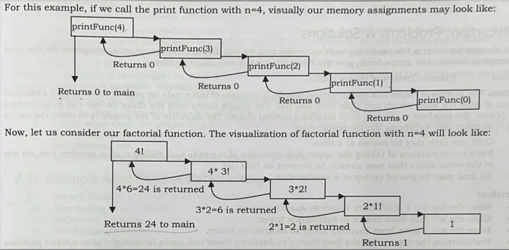

# Reacursion and Backtracking

## Recursion

Any functions which calls itself is called **recursive.** A recursive method solves a problem by calling a copy of itself to work on a smaller problem/section of code. This is called a **recursive step.** At some point the function encounters a subtask that it can perform without calling itself, this case where the function does not *recur* is called the **base case.** The former where the functioncalls itseld to perfom a subtask is referred to as the **resursive case.**

It is important to ensure that the recursion terminates.

### Recursion and Memory

Each resursive calls makes a new copy of that method/function (actually only the variables) in memory. Once the method returns the data, the copy of that method is removed from memory.

### Recursion vs Iteration

A recursive approach mirrors the problem that we are trying to solve. Depending on the requirement only use either recursion or iteration.

| Recursion    | Iteration |
| -------- | ------- |
| Terminates when base case in reached.  | Terminates when a condition is proven false.    |
| Each recursive calls requires extra space  on tak frame (memory) | Each iteration does not require extra space     |
| In case of infinite recursion, the program may run out of memory and result in stack overflow    | An infinite loop could loop forever since there is no extra memory being created.    |

Generally iterative solutions are more efficient than recursive solutions due to overhead of function calls.
(overhead is any combination of excess or indirect computation time, memory, bandwidth, or other resources that are required to perform a specific task.)
